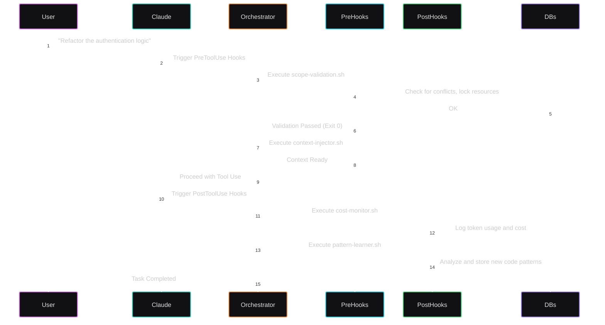
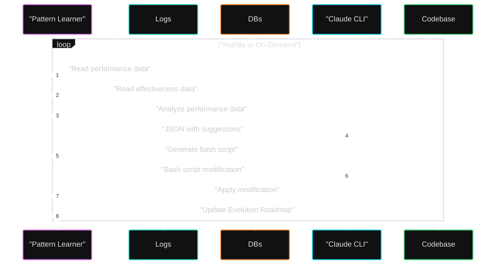
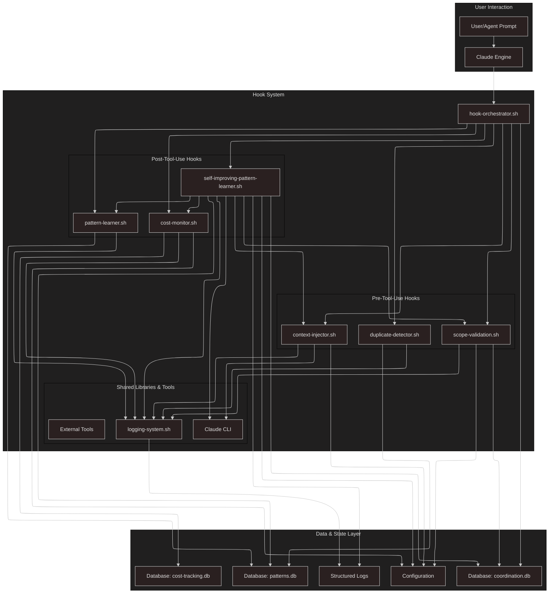
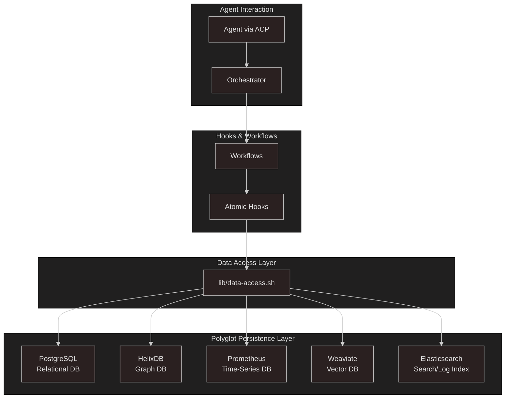
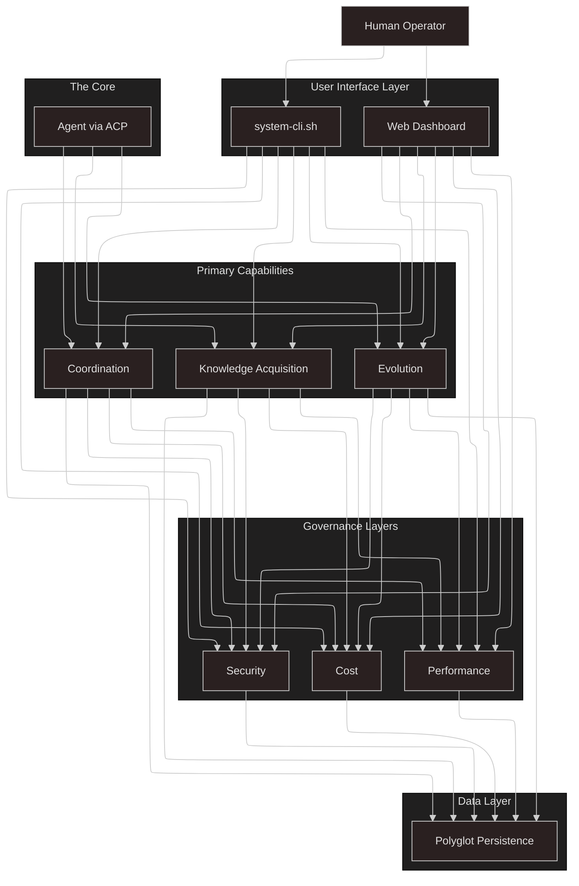
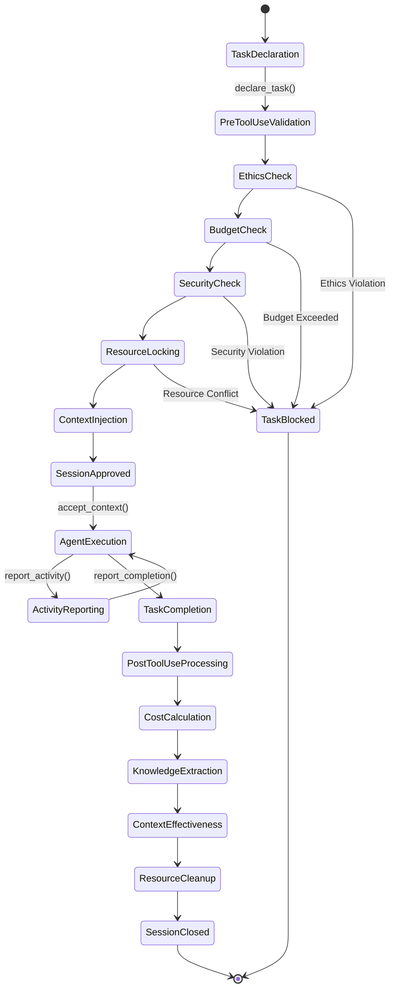
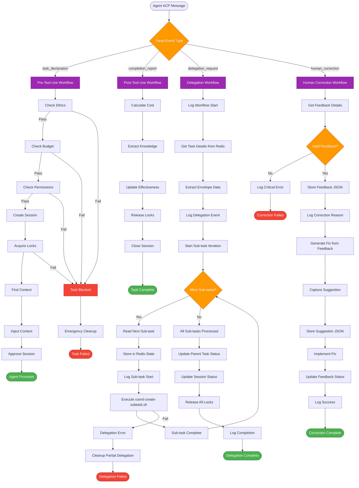
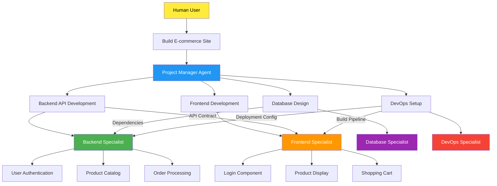
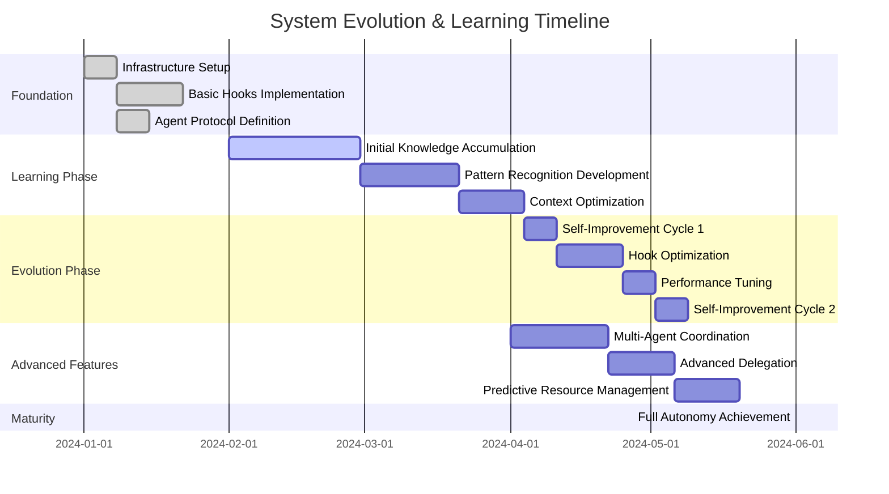

# LevAIthan System Architecture

This document provides visual representations of the LevAIthan system architecture, workflows, and interactions.

## 🔄 Core Agent Interaction Flow

The following sequence diagram shows how an agent interacts with the system through the Agent Coordination Protocol (ACP):

## 🧠 Self-Improvement Evolution Cycle

This diagram illustrates how the system continuously improves itself through analysis and automated code modification:

## 🏗️ Complete System Architecture

This comprehensive diagram shows all major components and their relationships:

## 🗄️ Polyglot Data Access Layer

The system uses multiple specialized databases, accessed through a unified data access layer:

## 👥 Human-AI Centaur Governance Model

This diagram shows the layered governance structure with human sovereignty:

## 📋 Agent Coordination Protocol (ACP) State Machine

This state machine shows the lifecycle of an agent session:

## 🔄 Hook Execution Flow

This flowchart shows how atomic hooks are composed into workflows:

## 🌐 Multi-Agent Delegation Graph

This shows how complex tasks can be broken down and delegated across multiple agents:

## 📊 System Evolution Timeline

This timeline shows how the system improves over time:

---

## 📋 Diagram Index

| Diagram | Purpose | Section |
|---------|---------|---------|
| **Core Agent Interaction Flow** | Shows basic task lifecycle | Workflow Understanding |
| **Self-Improvement Evolution Cycle** | Illustrates system learning | Evolution Engine |
| **Complete System Architecture** | Overview of all components | System Design |
| **Polyglot Data Access Layer** | Database abstraction | Data Architecture |
| **Human-AI Centaur Governance** | Sovereignty and control | Governance Model |
| **ACP State Machine** | Agent session lifecycle | Protocol Design |
| **Hook Execution Flow** | Workflow composition | Implementation |
| **Multi-Agent Delegation** | Complex task breakdown | Coordination |
| **System Evolution Timeline** | Development roadmap | Project Planning |
| **Security & Governance Architecture** | Multi-layered protection | Security Design |

These diagrams provide comprehensive visual documentation for the LevAIthan system, making it easier for developers, operators, and stakeholders to understand the architecture and workflows.
