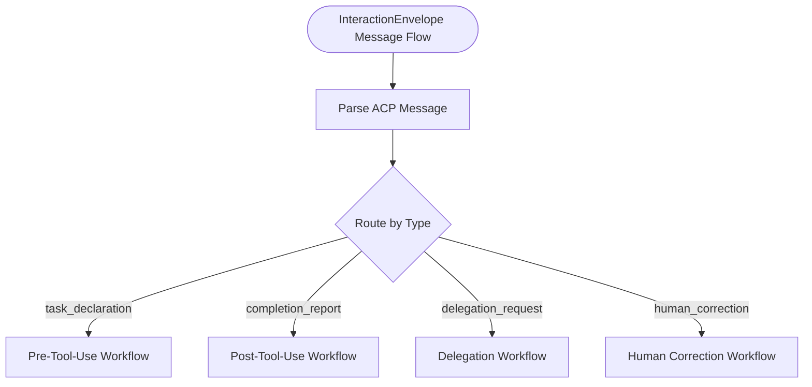
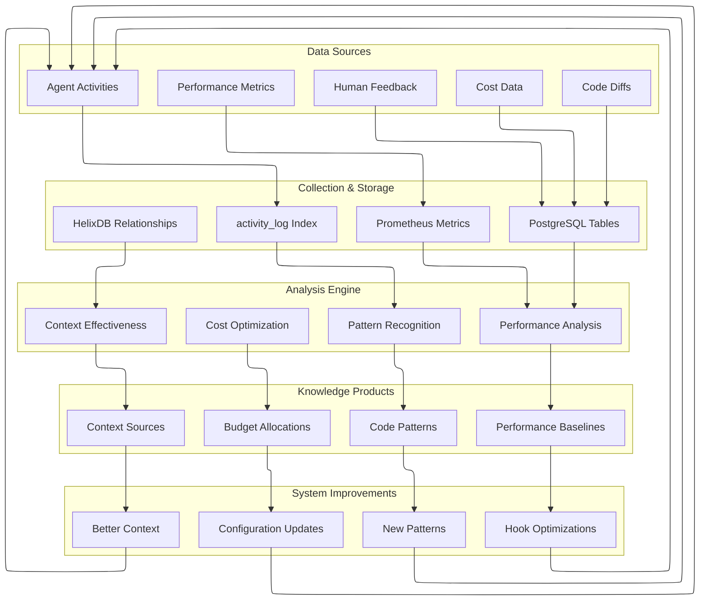
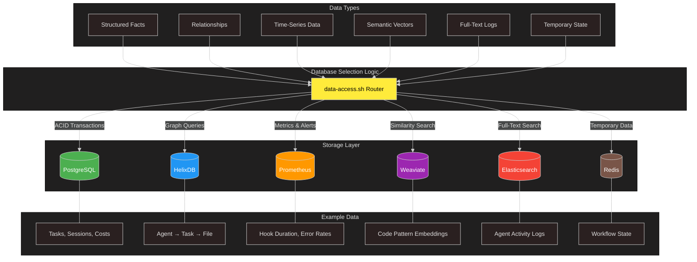
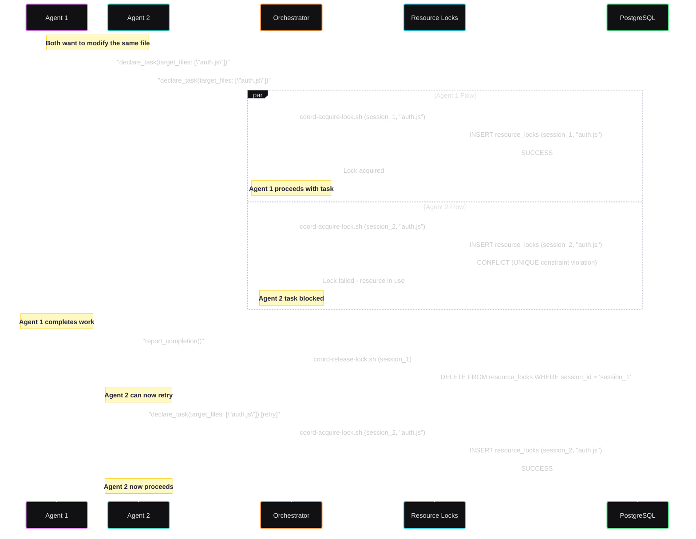
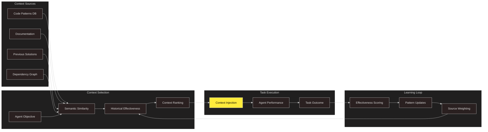
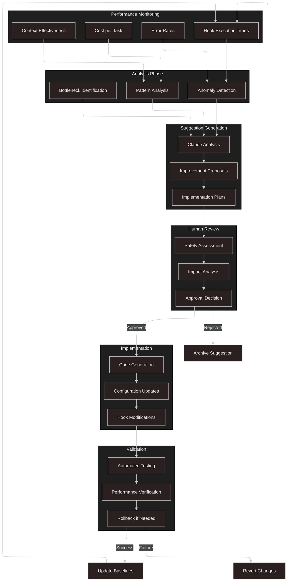
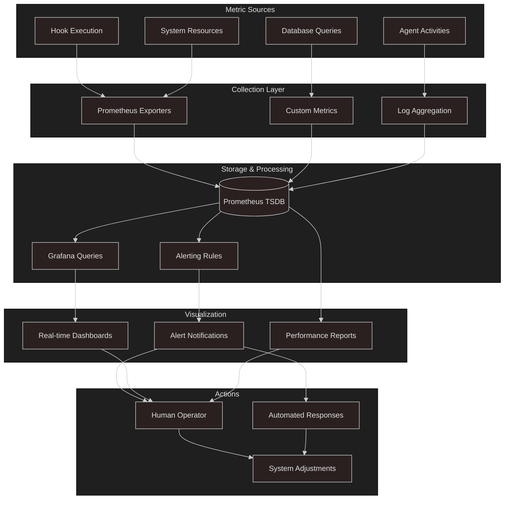

# LevAIthan Data Flow Diagrams

This document provides detailed views of how data flows through the LevAIthan system.

### 📊 InteractionEnvelope Message Flow

This diagram shows how ACP messages flow through the system:

---

## 🔄 Knowledge Accumulation Cycle

This shows how the system learns and improves over time:

## 🗄️ Database Interaction Patterns

This diagram shows how different types of data flow to appropriate databases:

## 🚦 Resource Lock Management

This sequence shows how resource conflicts are prevented:

## 💰 Cost Tracking & Budget Enforcement

This shows how financial controls work throughout the system:

```mermaid
---
config:
  theme: neo-dark
  layout: elk
---
flowchart TB
 subgraph BudgetValidation["Budget Validation Process"]
        GetCurrentSpend@{ label: "Query cost_records table<br>for today's agent spending" }
        BudgetCheck["governance-check-budget.sh"]
        GetBudgetLimit@{ label: "Query budget_allocations table<br>for agent's daily limit" }
        CalculateRemaining["Calculate remaining budget:<br>limit - current_spend"]
        BudgetDecision{"Current Spend &lt; Budget Limit?"}
        BudgetApproved["Budget Check Passed"]
        BudgetBlocked["Budget Exceeded - Task Blocked"]
  end
 subgraph CostCalculation["Cost Calculation Process"]
        CountTokens["Count Input/Output Tokens<br>from task execution"]
        CostCalc["cost-calculate-and-log.sh"]
        CalculateCost["Calculate total cost<br>using token pricing"]
        StoreCost["Insert into cost_records table<br>with agent_id, task_id, timestamp"]
  end
 subgraph BudgetMonitoring["Automated Budget Monitoring"]
        DailyAggregation["Sum costs by agent<br>for current day"]
        TriggerMonitoring["Trigger Budget Monitoring"]
        CheckThreshold{"Approaching budget limit?<br>(&gt;80% of allocation)"}
        AlertHuman["Send alert to Human Operator<br>via notification system"]
        ContinueMonitoring["Continue normal operations"]
        HumanDecision["Human Decision Required"]
        BudgetAction{"Increase Budget or<br>Block Further Tasks?"}
        UpdateBudget["Update budget_allocations table<br>with new limit"]
        BlockAgent["Set agent status to blocked<br>until next day reset"]
  end
 subgraph BudgetSetup["Budget Administration"]
        SetBudgets["Configure daily budgets<br>via system-cli.sh"]
        HumanOperator["Human Operator"]
        UpdateAllocations["Insert/Update budget_allocations table<br>with agent limits"]
  end
    Start(["Agent ACP Message"]) --> Parse{"Parse Event Type"}
    Parse -- task_declaration --> PreWorkflow["Pre-Tool-Use Workflow"]
    PreWorkflow --> Ethics["governance-check-ethics.sh"]
    Ethics --> BudgetCheck
    BudgetCheck --> GetCurrentSpend
    GetCurrentSpend --> GetBudgetLimit
    GetBudgetLimit --> CalculateRemaining
    CalculateRemaining --> BudgetDecision
    BudgetDecision -- Yes --> BudgetApproved
    BudgetDecision -- No --> BudgetBlocked
    BudgetApproved --> Security["governance-check-permissions.sh"]
    Security --> CreateSession["coord-create-session.sh"]
    CreateSession --> AcquireLocks["coord-acquire-lock.sh"]
    AcquireLocks --> FindContext["context-find-similar.sh"]
    FindContext --> InjectContext["context-inject-final.sh"]
    InjectContext --> ApproveSession["coord-approve-session.sh"]
    ApproveSession --> Success(["Agent Proceeds with Task"])
    Success --> TaskExecution["Agent Executes Task"]
    TaskExecution --> PostWorkflow["Post-Tool-Use Workflow"]
    PostWorkflow --> CostCalc
    CostCalc --> CountTokens
    CountTokens --> CalculateCost
    CalculateCost --> StoreCost
    StoreCost --> TriggerMonitoring & ExtractKnowledge["knowledge-extract-from-diff.sh"]
    TriggerMonitoring --> DailyAggregation
    DailyAggregation --> CheckThreshold
    CheckThreshold -- Yes --> AlertHuman
    CheckThreshold -- No --> ContinueMonitoring
    AlertHuman --> HumanDecision
    HumanDecision --> BudgetAction
    BudgetAction -- Increase --> UpdateBudget
    BudgetAction -- Block --> BlockAgent
    HumanOperator --> SetBudgets
    SetBudgets --> UpdateAllocations
    BudgetBlocked --> ErrorCleanup["Emergency Cleanup"]
    Ethics -- Fail --> ErrorCleanup
    Security -- Fail --> ErrorCleanup
    AcquireLocks -- Fail --> ErrorCleanup
    ErrorCleanup --> Failed(["Task Failed"])
    UpdateAllocations -.-> GetBudgetLimit
    UpdateBudget -.-> GetBudgetLimit
    BlockAgent -.-> BudgetCheck
    ExtractKnowledge --> UpdateEffectiveness["context-update-effectiveness.sh"]
    UpdateEffectiveness --> ReleaseLocks["coord-release-lock.sh"]
    ReleaseLocks --> CloseSession["coord-close-session.sh"]
    CloseSession --> Complete(["Task Complete"])
    GetCurrentSpend@{ shape: rect}
    GetBudgetLimit@{ shape: rect}
    style BudgetDecision fill:#FF9800,color:#fff
    style BudgetApproved fill:#4CAF50,color:#fff
    style BudgetBlocked fill:#f44336,color:#fff
    style CheckThreshold fill:#FF9800,color:#fff
    style AlertHuman fill:#FF9800,color:#fff
    style HumanDecision fill:#2196F3,color:#fff
    style BudgetAction fill:#FF9800,color:#fff
    style Parse fill:#FF9800,color:#fff
    style Success fill:#4CAF50,color:#fff
    style Failed fill:#f44336,color:#fff
    style Complete fill:#4CAF50,color:#fff
```

## 🧠 Context Injection & Effectiveness Tracking

This diagram shows how the system learns which context is most helpful:

## 🔄 Self-Improvement Feedback Loop

This shows the complete cycle of system evolution:

## 📈 Performance Metrics Dashboard Data Flow

This shows how real-time monitoring data is collected and displayed:

---

These data flow diagrams complement the architectural diagrams by showing the dynamic aspects of the system - how information moves, transforms, and creates feedback loops that enable continuous improvement and learning.
