# LevAIthan Deployment & Operations Diagrams

This document provides visual guides for deploying, monitoring, and operating the LevAIthan system.

## 🚀 Deployment Architecture

This diagram shows the complete infrastructure stack:

```mermaid
---
config:
  layout: elk
---
flowchart TB
    subgraph dev ["Development Environment"]
    subgraph docker ["Docker Services"]
            PG[("🗄️ PostgreSQL<br/>Port: 5432")]
            NEO[("🔗 HelixDb<br/>Ports: 7474/7687")]
            PROM[("📊 Prometheus<br/>Port: 9090")]
            WAVE[("🔍 Weaviate<br/>Port: 8080")]
            ES[("📑 Elasticsearch<br/>Port: 9200")]
            REDIS[("⚡ Redis<br/>Port: 6379")]
        end
        
        subgraph app ["Application Layer"]
            HOOKS["📂 .claude/hooks/<br/>System Logic & Embedding"]
            CONFIG["⚙️ .claude/context/<br/>Configuration"]
            LOGS["📋 .claude/logs/<br/>Audit Trail"]
        end
        
        subgraph interface ["User Interfaces"]
            CLI["💻 Command Line<br/>system-cli.sh"]
            DASH["🖥️ Web Dashboard<br/>Port: 3000"]
            API["🔌 REST API<br/>Port: 8000"]
        end
    end
    
    subgraph external ["External Services"]
        CLAUDE["🤖 Claude API<br/>AI Processing"]
        ALERTS["🚨 Alert Manager<br/>Notifications"]
    end
    
    %% Internal connections
    HOOKS --> PG
    HOOKS --> NEO
    HOOKS --> PROM
    HOOKS --> WAVE
    HOOKS --> ES
    HOOKS --> REDIS
    CLI --> HOOKS
    DASH --> API
    API --> HOOKS
    
    %% External connections
    HOOKS -.-> CLAUDE
    PROM -.-> ALERTS
    
    %% Styling
    classDef database fill:#e1f5fe,stroke:#0277bd,stroke-width:2px
    classDef application fill:#f3e5f5,stroke:#7b1fa2,stroke-width:2px
    classDef interface fill:#e8f5e9,stroke:#388e3c,stroke-width:2px
    classDef external fill:#fff3e0,stroke:#f57c00,stroke-width:2px
    
    class PG,NEO,PROM,WAVE,ES,REDIS database
    class HOOKS,CONFIG,LOGS application
    class CLI,DASH,API interface
    class CLAUDE,ALERTS external

```




## 📊 Monitoring & Observability Stack

This shows the complete monitoring and alerting setup:

```mermaid
flowchart LR
    subgraph sources ["📈 Data Sources"]
        A["⚡ Hook Executions<br/>Performance & Errors"]
        B["💻 System Resources<br/>CPU, Memory, Disk"]
        C["🗄️ Database Health<br/>Query Performance"]
        D["📝 Application Logs<br/>Structured Events"]
        E["💰 Business Metrics<br/>Costs & ROI"]
    end
    
    subgraph storage ["💾 Data Storage"]
        F[("⏰ Prometheus<br/>Time Series DB")]
        G[("🔍 Elasticsearch<br/>Log Storage")]
        H["📄 Log Files<br/>Raw Data")]
    end
    
    subgraph processing ["⚙️ Data Processing"]
        I["🚨 Alert Rules<br/>Threshold Monitoring"]
        J["📊 Log Analysis<br/>Pattern Detection"]
        K["📈 Metric Aggregation<br/>Trend Analysis"]
    end
    
    subgraph visualization ["📱 User Interfaces"]
        L["📊 Grafana Dashboards<br/>Visual Monitoring"]
        M["🔔 Alert Manager<br/>Notification Hub"]
        N["🔍 Log Explorer<br/>Search Interface"]
    end
    
    subgraph actions ["🎯 Response Actions"]
        O["Human Operators<br/>Manual Intervention"]
        P["Auto Responses<br/>Predefined Actions"]
        Q["Self Healing<br/>Adaptive Systems"]
    end
    
    %% Data flow
    A --> F
    B --> F
    C --> F
    D --> G
    E --> F
    
    F --> I
    G --> J
    F --> K
    
    I --> M
    J --> N
    K --> L
    
    L --> O
    M --> O
    N --> O
    
    M --> P
    P --> Q
    
    %% Styling
    classDef source fill:#e8f5e9,stroke:#388e3c,stroke-width:2px
    classDef store fill:#e1f5fe,stroke:#0277bd,stroke-width:2px
    classDef process fill:#fff3e0,stroke:#f57c00,stroke-width:2px
    classDef visual fill:#f3e5f5,stroke:#7b1fa2,stroke-width:2px
    classDef action fill:#ffebee,stroke:#d32f2f,stroke-width:2px
    
    class A,B,C,D,E source
    class F,G,H store
    class I,J,K process
    class L,M,N visual
    class O,P,Q action
```

## 🔧 Developer Workflow

This shows the complete development and testing process:

```mermaid
flowchart TD
    subgraph setup ["🚀 Initial Setup"]
        A["📥 Clone Repository<br/>git clone LevAIthan"]
        B["⚙️ Configure Environment<br/>cp .env.template .env"]
        C["🐳 Start Services<br/>docker-compose up -d"]
        D["🔧 Initialize System<br/>./setup.sh"]
    end
    
    subgraph coding ["💻 Development Phase"]
        E["📝 Edit Atomic Hooks<br/>Core System Logic"]
        F["🔄 Update Workflows<br/>Process Orchestration"]
        G["📚 Modify Libraries<br/>Shared Components"]
    end
    
    subgraph testing ["🧪 Testing Pipeline"]
        H["🔬 Unit Tests<br/>Component Testing"]
        I["🔗 Integration Tests<br/>Service Integration"]
        J["🎯 End-to-End Tests<br/>Complete Workflows"]
        K["⚡ Performance Tests<br/>Load & Stress"]
    end
    
    subgraph validation ["✅ Quality Assurance"]
        L["🔍 Hook Validation<br/>Logic Verification"]
        M["🗄️ Schema Validation<br/>Database Integrity"]
        N["🔒 Security Scan<br/>Vulnerability Check"]
        O["📖 Documentation<br/>Knowledge Update"]
    end
    
    subgraph deploy ["🚀 Deployment Process"]
        P["🏠 Local Testing<br/>Developer Machine"]
        Q["🎭 Staging Environment<br/>Production Mirror"]
        R["🌐 Production Deploy<br/>Live System"]
    end
    
    %% Workflow connections
    A --> B --> C --> D
    D --> E
    D --> F
    D --> G
    E --> H
    F --> I
    G --> J
    H --> K
    I --> K
    J --> K
    K --> L
    L --> M
    M --> N
    N --> O
    O --> P
    P --> Q
    Q --> R
    
    %% Styling
    classDef setup fill:#e8f5e9,stroke:#388e3c,stroke-width:3px
    classDef coding fill:#e1f5fe,stroke:#0277bd,stroke-width:2px
    classDef testing fill:#fff3e0,stroke:#f57c00,stroke-width:2px
    classDef validation fill:#f3e5f5,stroke:#7b1fa2,stroke-width:2px
    classDef deploy fill:#ffebee,stroke:#d32f2f,stroke-width:3px
    
    class A,B,C,D setup
    class E,F,G coding
    class H,I,J,K testing
    class L,M,N,O validation
    class P,Q,R deploy
```



## 🚨 Incident Response & Alerting

This diagram shows how the system handles problems and alerts:

```mermaid
---
config:
    layout: elk
---
flowchart TB
    subgraph detection ["🔍 Problem Detection"]
        A["❌ High Error Rate<br/>System Failures"]
        B["💸 Budget Exceeded<br/>Cost Overruns"]
        C["⚔️ Resource Conflicts<br/>Competition Issues"]
        D["🐌 Performance Issues<br/>Slow Responses"]
        E["🔒 Security Violations<br/>Unauthorized Access"]
    end
    
    subgraph classification ["📊 Alert Classification"]
        F{"⚡ Severity Assessment"}
        G["🔴 P0 Critical<br/>Immediate Action"]
        H["🟠 P1 High<br/>15 Min Response"]
        I["🟡 P2 Medium<br/>1 Hour Response"]
        J["🟢 P3 Low<br/>24 Hour Response"]
    end
    
    subgraph response ["🎯 Response Actions"]
        K["🛑 Emergency Stop<br/>System Halt"]
        L["📱 Human Alert<br/>Team Notification"]
        M["🤖 Auto Mitigation<br/>Automated Fix"]
        N["📈 Resource Scaling<br/>Capacity Increase"]
        O["🔄 Graceful Degradation<br/>Reduced Functionality"]
    end
    
    subgraph resolution ["🔧 Problem Resolution"]
        P["🔬 Root Cause Analysis<br/>Deep Investigation"]
        Q["⚒️ Fix Implementation<br/>Solution Deployment"]
        R["✅ Testing & Verification<br/>Solution Validation"]
        S["📝 Post-Incident Review<br/>Learning & Improvement"]
    end
    
    %% Detection to classification
    A --> F
    B --> F
    C --> F
    D --> F
    E --> F
    
    %% Classification outcomes
    F -->|Critical| G
    F -->|High| H
    F -->|Medium| I
    F -->|Low| J
    
    %% Response actions
    G --> K
    G --> L
    H --> L
    H --> M
    I --> M
    I --> N
    J --> O
    
    %% Resolution process
    K --> P
    L --> P
    M --> P
    N --> P
    O --> P
    P --> Q
    Q --> R
    R --> S
    
    %% Styling
    classDef critical fill:#ffebee,stroke:#d32f2f,stroke-width:3px
    classDef high fill:#fff3e0,stroke:#f57c00,stroke-width:2px
    classDef medium fill:#fffde7,stroke:#fbc02d,stroke-width:2px
    classDef low fill:#e8f5e9,stroke:#388e3c,stroke-width:2px
    classDef resolution fill:#e1f5fe,stroke:#0277bd,stroke-width:2px
    
    class A,B,C,D,E,G,K critical
    class H,L,M high
    class I,N medium
    class J,O low
    class P,Q,R,S resolution
```



## 📈 System Scaling Strategy

This shows how the system grows from small to enterprise scale:

```mermaid
graph TB
    subgraph phase1 ["🏠 Phase 1: Single Node"]
        A["🖥️ All-in-One Setup<br/>Single Machine Deployment"]
        B["👥 Agent Count: < 10<br/>Small Team Usage"]
        C["📊 Daily Tasks: < 1,000<br/>Light Workload"]
    end
    
    subgraph phase2 ["🏢 Phase 2: Database Separation"]
        D["🗄️ Dedicated DB Servers<br/>Specialized Infrastructure"]
        E["📈 Application Scaling<br/>Load Distribution"]
        F["👥 Agent Count: 10-50<br/>Growing Team"]
        G["📊 Daily Tasks: 1K-10K<br/>Medium Workload"]
    end
    
    subgraph phase3 ["🏭 Phase 3: Microservices"]
        H["🔧 Service Decomposition<br/>Modular Architecture"]
        I["⚖️ Load Balancing<br/>Traffic Distribution"]
        J["👥 Agent Count: 50-200<br/>Large Team"]
        K["📊 Daily Tasks: 10K-100K<br/>Heavy Workload"]
    end
    
    subgraph phase4 ["🌐 Phase 4: Global Distribution"]
        L["🌍 Multi-Region Deploy<br/>Global Presence"]
        M["📊 Sharded Databases<br/>Horizontal Scaling"]
        N["👥 Agent Count: 200+<br/>Enterprise Scale"]
        O["📊 Daily Tasks: 100K+<br/>Enterprise Workload"]
    end
    
    %% Evolution path
    A -.->|Growth| D
    D -.->|Scale| H
    H -.->|Global| L
    
    %% Styling
    classDef starter fill:#e8f5e9,stroke:#388e3c,stroke-width:3px
    classDef growth fill:#fff3e0,stroke:#f57c00,stroke-width:3px
    classDef scale fill:#e1f5fe,stroke:#0277bd,stroke-width:3px
    classDef enterprise fill:#f3e5f5,stroke:#7b1fa2,stroke-width:3px
    
    class A,B,C starter
    class D,E,F,G growth
    class H,I,J,K scale
    class L,M,N,O enterprise
```



## 🔒 Security Architecture

This shows the comprehensive security approach:

```mermaid
graph TB
    subgraph network ["🛡️ Network Security"]
        A["🏰 VPC/Private Network<br/>Isolated Environment"]
        B["🚪 Firewall Rules<br/>Access Control"]
        C["🔐 SSL Load Balancer<br/>Encrypted Traffic"]
    end
    
    subgraph application ["💻 Application Security"]
        D["✅ Input Validation<br/>Data Sanitization"]
        E["🔑 Auth & Authorization<br/>Identity Management"]
        F["⏱️ Rate Limiting<br/>Abuse Prevention"]
        G["📋 Audit Logging<br/>Activity Tracking"]
    end
    
    subgraph data ["💾 Data Security"]
        H["🔒 Encryption at Rest<br/>Stored Data Protection"]
        I["🚀 Encryption in Transit<br/>Communication Security"]
        J["🗄️ Database Access Control<br/>Permission Management"]
        K["💿 Backup Encryption<br/>Archive Protection"]
    end
    
    subgraph operational ["⚙️ Operational Security"]
        L["🔐 Secret Management<br/>Credential Protection"]
        M["🔍 Security Scanning<br/>Vulnerability Detection"]
        N["🛡️ Vulnerability Assessment<br/>Risk Evaluation"]
        O["🚨 Incident Response<br/>Threat Mitigation"]
    end
    
    subgraph governance ["👑 Governance Security"]
        P["⚖️ Ethics Enforcement<br/>Responsible AI Use"]
        Q["💰 Budget Controls<br/>Cost Management"]
        R["👨‍💼 Human Oversight<br/>Manual Review"]
        S["🛑 Emergency Controls<br/>Kill Switch"]
    end
    
    %% Security layers
    A --> B
    B --> C
    C --> D
    D --> E
    E --> F
    F --> G
    G --> H
    H --> I
    I --> J
    J --> K
    K --> L
    L --> M
    M --> N
    N --> O
    O --> P
    P --> Q
    Q --> R
    R --> S
    
    %% Styling
    classDef network fill:#ffebee,stroke:#d32f2f,stroke-width:2px
    classDef app fill:#fff3e0,stroke:#f57c00,stroke-width:2px
    classDef data fill:#e8f5e9,stroke:#388e3c,stroke-width:2px
    classDef ops fill:#e1f5fe,stroke:#0277bd,stroke-width:2px
    classDef gov fill:#f3e5f5,stroke:#7b1fa2,stroke-width:2px
    
    class A,B,C network
    class D,E,F,G app
    class H,I,J,K data
    class L,M,N,O ops
    class P,Q,R,S gov
```



## 💾 Backup & Recovery Strategy

This shows comprehensive data protection and disaster recovery:

```mermaid
flowchart LR
    subgraph sources ["📊 Data Sources"]
        A[("🗄️ PostgreSQL<br/>Primary Database")]
        B[("🔗 HelixDB<br/>Graph Database")]
        C[("📑 Elasticsearch<br/>Search Index")]
        D["⚙️ Configuration Files<br/>System Settings"]
        E["📦 Code Repository<br/>Application Code"]
    end
    
    subgraph backup ["💾 Backup Types"]
        F["📝 Continuous WAL<br/>Write-Ahead Logs"]
        G["📅 Daily Full Backup<br/>Complete Snapshots"]
        H["📦 Weekly Archive<br/>Long-term Storage"]
        I["⚙️ Config Snapshots<br/>Settings Backup"]
    end
    
    subgraph storage ["🏠 Storage Locations"]
        J["💻 Local Storage<br/>Fast Recovery"]
        K["☁️ Cloud Storage<br/>Redundant Copies"]
        L["🏢 Offsite Archive<br/>Disaster Recovery"]
    end
    
    subgraph recovery ["🔧 Recovery Procedures"]
        M["⏰ Point-in-Time Recovery<br/>Precise Restoration"]
        N["🔄 Full System Restore<br/>Complete Recovery"]
        O["🎯 Partial Data Recovery<br/>Selective Restoration"]
        P["⚙️ Configuration Rollback<br/>Settings Recovery"]
    end
    
    %% Backup flows
    A --> F
    A --> G
    B --> G
    B --> H
    C --> G
    D --> I
    E --> I
    
    %% Storage distribution
    F --> J
    F --> K
    G --> J
    G --> K
    G --> L
    H --> L
    I --> J
    I --> K
    
    %% Recovery options
    J --> M
    J --> N
    J --> O
    J --> P
    K --> M
    K --> N
    K --> O
    K --> P
    L --> M
    L --> N
    L --> O
    L --> P
    
    %% Styling
    classDef source fill:#e1f5fe,stroke:#0277bd,stroke-width:2px
    classDef backup fill:#fff3e0,stroke:#f57c00,stroke-width:2px
    classDef storage fill:#e8f5e9,stroke:#388e3c,stroke-width:2px
    classDef recovery fill:#f3e5f5,stroke:#7b1fa2,stroke-width:2px
    
    class A,B,C,D,E source
    class F,G,H,I backup
    class J,K,L storage
    class M,N,O,P recovery
```



## 🎛️ Operations Dashboard Layout

This shows the recommended dashboard organization for different user roles:

```mermaid
graph TB
    subgraph executive ["👔 Executive Dashboard"]
        A["📊 System Health Overview<br/>Green/Yellow/Red Status"]
        B["💰 Cost & Budget Summary<br/>Financial Performance"]
        C["✅ Task Success Rates<br/>Operational Metrics"]
        D["🤖 Agent Performance<br/>Productivity Metrics"]
    end
    
    subgraph operational ["⚙️ Operational Dashboard"]
        E["📋 Real-time Task Queue<br/>Current Workload"]
        F["📈 Resource Utilization<br/>System Capacity"]
        G["⚠️ Error Rates & Alerts<br/>Problem Monitoring"]
        H["⚡ Performance Metrics<br/>Speed & Efficiency"]
    end
    
    subgraph technical ["🔧 Technical Dashboard"]
        I["🗄️ Database Performance<br/>Query Optimization"]
        J["⏱️ Hook Execution Times<br/>Code Performance"]
        K["💻 System Resources<br/>Infrastructure Health"]
        L["🔒 Network & Security<br/>Threat Monitoring"]
    end
    
    subgraph business ["📈 Business Dashboard"]
        M["💎 ROI & Value Metrics<br/>Business Impact"]
        N["😊 User Satisfaction<br/>Experience Quality"]
        O["🚀 System Evolution<br/>Improvement Tracking"]
        P["📊 Capacity Planning<br/>Growth Forecasting"]
    end
    
    %% Styling
    classDef executive fill:#ffebee,stroke:#d32f2f,stroke-width:3px
    classDef operational fill:#fff3e0,stroke:#f57c00,stroke-width:2px
    classDef technical fill:#e1f5fe,stroke:#0277bd,stroke-width:2px
    classDef business fill:#e8f5e9,stroke:#388e3c,stroke-width:2px
    
    class A,B,C,D executive
    class E,F,G,H operational
    class I,J,K,L technical
    class M,N,O,P business
```



## 🔄 DevOps CI/CD Pipeline

This shows the complete continuous integration and deployment process:

```mermaid
flowchart TD
    subgraph source ["📦 Source Control"]
        A["📁 Git Repository<br/>Version Control"]
        B["🌿 Feature Branches<br/>Isolated Development"]
        C["🔄 Pull Requests<br/>Code Review Process"]
    end
    
    subgraph ci ["🔍 CI Pipeline"]
        D["📝 Code Quality Check<br/>Linting & Standards"]
        E["🔒 Security Scan<br/>Vulnerability Check"]
        F["🧪 Unit Tests<br/>Component Testing"]
        G["🔗 Integration Tests<br/>Service Testing"]
    end
    
    subgraph build ["🏗️ Build & Package"]
        H["🐳 Docker Build<br/>Container Creation"]
        I["✅ Config Validation<br/>Settings Verification"]
        J["📖 Documentation Gen<br/>Auto Documentation"]
    end
    
    subgraph deploy ["🚀 Deployment"]
        K["🎭 Staging Environment<br/>Pre-production Test"]
        L["🎯 End-to-End Tests<br/>Full System Test"]
        M["🌐 Production Deploy<br/>Live Release"]
        N["💓 Health Checks<br/>System Validation"]
    end
    
    subgraph monitor ["📊 Monitoring"]
        O["⚡ Performance Monitor<br/>Speed Tracking"]
        P["❌ Error Tracking<br/>Issue Detection"]
        Q["💬 User Feedback<br/>Experience Metrics"]
        R["🔄 Rollback Process<br/>Quick Recovery"]
    end
    
    %% Pipeline flow
    A --> B
    B --> C
    C --> D
    D --> E
    E --> F
    F --> G
    G --> H
    H --> I
    I --> J
    J --> K
    K --> L
    L --> M
    M --> N
    N --> O
    O --> P
    P --> Q
    Q --> R
    
    %% Styling
    classDef source fill:#e1f5fe,stroke:#0277bd,stroke-width:2px
    classDef ci fill:#fff3e0,stroke:#f57c00,stroke-width:2px
    classDef build fill:#e8f5e9,stroke:#388e3c,stroke-width:2px
    classDef deploy fill:#f3e5f5,stroke:#7b1fa2,stroke-width:2px
    classDef monitor fill:#ffebee,stroke:#d32f2f,stroke-width:2px
    
    class A,B,C source
    class D,E,F,G ci
    class H,I,J build
    class K,L,M,N deploy
    class O,P,Q,R monitor
```



---

## 📋 Operations Checklist

### 🌅 Daily Operations
- [ ] **System Health Check** - Review dashboard status indicators
- [ ] **Task Completion Review** - Analyze overnight automation results
- [ ] **Budget Monitoring** - Check cost vs budget tracking
- [ ] **Error Investigation** - Review failed hooks and workflows
- [ ] **Performance Review** - Monitor agent response times

### 📅 Weekly Operations
- [ ] **Trend Analysis** - Review learning and evolution patterns
- [ ] **Improvement Review** - Approve system enhancement suggestions
- [ ] **Database Optimization** - Check performance and tune queries
- [ ] **Documentation Updates** - Keep system knowledge current
- [ ] **Backup Validation** - Test restore procedures

### 📆 Monthly Operations
- [ ] **Capacity Planning** - Assess scaling and growth needs
- [ ] **Security Review** - Conduct vulnerability assessments
- [ ] **Performance Baseline** - Update system benchmarks
- [ ] **Agent Lifecycle** - Review onboarding and offboarding
- [ ] **Disaster Recovery** - Test emergency procedures

These updated deployment and operational diagrams provide clear, user-friendly guidance for successfully running the LevAIthan system in production environments.