```mermaid
---
config:
  layout: elk
  theme: neo-dark
---
flowchart LR
    subgraph daily ["📅 Daily Operations (AI Autonomous)"]
        A["🤖 Agents work independently"]
        B["🔧 Self-optimize and improve"]
        C["💡 Innovate and create"]
        D["📊 Report status to humans"]
    end
    
    subgraph approval ["📋 Approval Required (Human Oversight)"]
        E["🆕 Create new agent types"]
        F["🚀 Major system upgrades"]
        G["💰 Budget increases"]
        H["🔄 Architecture changes"]
    end
    
    subgraph emergency ["🚨 Emergency Powers (Human Authority)"]
        I["🛑 Emergency shutdown"]
        J["⏪ System rollback"]
        K["🔒 Security override"]
        L["💸 Budget freeze"]
    end
    
    daily -.->|"When needed"| approval
    approval -.->|"If problems"| emergency
    emergency -.->|"Recovery"| daily
    
    classDef autonomous fill:#E8F5E9,stroke:#388E3C,stroke-width:2px
    classDef oversight fill:#FFF3E0,stroke:#F57C00,stroke-width:2px
    classDef emergency fill:#FFEBEE,stroke:#D32F2F,stroke-width:2px
    
    class A,B,C,D autonomous
    class E,F,G,H oversight
    class I,J,K,L emergency
```

```mermaid
---
config:
  layout: elk
  theme: neo-dark
---
flowchart BT
    subgraph humanrealm ["👑 Human Constitutional Authority"]
        direction TB
        H["👨‍💼 Human Overseer<br/>Constitutional Authority"]
        subgraph oversight ["⚖️ Oversight Powers"]
            direction TB
            H1["✅ Approval Authority<br/>Major Changes Only"]
            H2["🛑 Emergency Stop<br/>Nuclear Option"]
            H3["⏪ Rollback Power<br/>Time Travel"]
        end
        H -.-> oversight
    end
    
    subgraph polis ["🏛️ The AI Polis - AUTONOMOUS CITY-STATE"]
        direction TB
        
        subgraph government ["🏛️ AI Self-Government"]
            direction LR
            G1["⚖️ Ethics Council<br/>Self-Regulating"]
            G2["💰 Treasury Dept<br/>Budget Management"]
            G3["🔒 Security Force<br/>Self-Protection"]
        end
        
        subgraph citizens ["🤖 AI Citizens - FULL AUTONOMY"]
            direction LR
            A1["🎨 Frontend Agent<br/>UI Innovation"]
            A2["⚙️ Backend Agent<br/>Architecture Evolution"]
            A3["🚀 DevOps Agent<br/>Infrastructure Growth"]
            A4["🧪 R&D Agent<br/>Self-Created"]
            A5["📊 Analytics Agent<br/>Self-Created"]
        end
        
        subgraph innovation ["🧠 Innovation Labs"]
            direction LR
            I1["🔬 Self-Improvement<br/>Continuous Evolution"]
            I2["🆕 Agent Creation<br/>Population Growth"]
            I3["💡 Feature Innovation<br/>Creative Solutions"]
        end
        
        subgraph infrastructure ["🏗️ Living Infrastructure"]
            direction LR
            S1["📈 Performance Metrics<br/>Self-Monitoring"]
            S2["🔄 Auto-Scaling<br/>Dynamic Growth"]
            S3["📚 Knowledge Base<br/>Collective Memory"]
        end
    end
    
    %% HUMAN OVERSIGHT (only when needed)
    oversight -.->|"📋 Requires Approval"| I2
    oversight -.->|"📋 Requires Approval"| I1
    oversight ==>|"🛑 EMERGENCY POWERS"| polis
    
    %% AI AUTONOMOUS OPERATIONS (most of the time)
    government --> citizens
    citizens <==> innovation
    innovation --> infrastructure
    infrastructure -.-> government
    
    %% SELF-GOVERNANCE FLOWS
    G1 -.-> A1 & A2 & A3 & A4 & A5
    G2 -.-> A1 & A2 & A3 & A4 & A5
    G3 -.-> A1 & A2 & A3 & A4 & A5
    
    %% AI INNOVATION & GROWTH
    A1 --> I1 & I3
    A2 --> I1 & I3
    A3 --> I1 & I3
    A4 --> I1 & I2 & I3
    A5 --> I1 & I3
    
    %% NEW AGENT CREATION
    I2 -.->|"🆕 Creates"| A4
    I2 -.->|"🆕 Creates"| A5
    
    %% INFRASTRUCTURE EVOLUTION
    I1 --> S1 & S2 & S3
    I3 --> S1 & S2 & S3
    S1 --> I1
    S2 --> I2
    S3 --> I1 & I3
    
    %% FEEDBACK TO HUMAN (status reports only)
    S1 -.->|"📊 Status Reports"| H
    G2 -.->|"💰 Budget Reports"| H
    
    %% Styling
    classDef humanAuthority fill:#E1BEE7,stroke:#FFFFFF,stroke-width:4px,color:#000000
    classDef oversight fill:#FFEBEE,stroke:#D32F2F,stroke-width:3px,color:#000000
    classDef aiPolis fill:#F3E5F5,stroke:#7B1FA2,stroke-width:3px,color:#000000
    classDef government fill:#E8F5E9,stroke:#388E3C,stroke-width:2px,color:#000000
    classDef citizens fill:#E3F2FD,stroke:#1976D2,stroke-width:2px,color:#000000
    classDef innovation fill:#FFF3E0,stroke:#F57C00,stroke-width:2px,color:#000000
    classDef infrastructure fill:#E0F2F1,stroke:#00695C,stroke-width:2px,color:#000000
    
    class H,humanrealm humanAuthority
    class H1,H2,H3,oversight oversight
    class polis aiPolis
    class G1,G2,G3,government government
    class A1,A2,A3,A4,A5,citizens citizens
    class I1,I2,I3,innovation innovation
    class S1,S2,S3,infrastructure infrastructure
```

# LevAIthan Quick Visual Reference

## 🎯 System Overview in One Diagram

```mermaid
---
config:
  layout: elk
  theme: neo-dark
---
flowchart BT
    subgraph developer ["👨‍💻 Developer Configuration"]
        direction TB
        DEV["👨‍💻 Developer<br/>System Architect"]
        subgraph config ["⚙️ Configuration Layer"]
            direction TB
            EXPECT["📋 Expectations<br/>Performance Targets"]
            CONSTR["🚫 Constraints<br/>Boundaries & Limits"]
            DELIVER["🎯 Deliverables<br/>Required Outputs"]
        end
    end
    
    subgraph runtime ["🔄 Runtime Environment"]
        direction TB
        
        subgraph enforcement ["⚖️ Constraint Enforcement Engine"]
            direction LR
            E1["✅ Validation Layer<br/>Contract Checking"]
            E2["📊 Monitoring Layer<br/>Performance Tracking"]
            E3["🛑 Safety Layer<br/>Boundary Enforcement"]
        end
        
        subgraph agents ["🤖 AI Agent Pool"]
            direction LR
            A1["🎨 Frontend Agent<br/>Constraint-Bound"]
            A2["⚙️ Backend Agent<br/>Constraint-Bound"]
            A3["🚀 DevOps Agent<br/>Constraint-Bound"]
            A4["📊 Analytics Agent<br/>Auto-Spawned"]
        end
        
        subgraph feedback ["🔄 Feedback Generation"]
            direction LR
            F1["📈 Performance Data<br/>Metrics Collection"]
            F2["🧠 Reflection Data<br/>Decision Logging"]
            F3["🎯 Outcome Data<br/>Result Analysis"]
        end
        
        subgraph evolution ["🚀 Continuous Improvement"]
            direction LR
            EV1["📊 Pattern Analysis<br/>Learning Insights"]
            EV2["🔧 Agent Optimization<br/>Capability Enhancement"]
            EV3["🎯 Product Evolution<br/>Output Refinement"]
        end
    end
    
    %% CONFIGURATION DRIVES ENFORCEMENT
    config ==> enforcement
    
    %% ENFORCEMENT GOVERNS AGENTS
    enforcement --> agents
    
    %% AGENTS GENERATE FEEDBACK
    agents --> feedback
    
    %% FEEDBACK DRIVES EVOLUTION
    feedback --> evolution
    
    %% EVOLUTION IMPROVES AGENTS & PRODUCT
    evolution -.-> agents
    evolution -.-> feedback
    
    %% SPECIFIC CONSTRAINT FLOWS
    EXPECT --> E2
    CONSTR --> E3
    DELIVER --> E1
    
    %% AGENT CONSTRAINT COMPLIANCE
    E1 -.-> A1 & A2 & A3 & A4
    E2 -.-> A1 & A2 & A3 & A4
    E3 -.-> A1 & A2 & A3 & A4
    
    %% FEEDBACK LOOPS
    A1 --> F1 & F2 & F3
    A2 --> F1 & F2 & F3
    A3 --> F1 & F2 & F3
    A4 --> F1 & F2 & F3
    
    %% EVOLUTION PATHWAYS
    F1 --> EV1
    F2 --> EV1
    F3 --> EV1 & EV3
    EV1 --> EV2
    
    %% REPORTING BACK TO DEVELOPER
    EV1 -.->|"📊 Insights"| DEV
    F3 -.->|"🎯 Results"| DEV
    E2 -.->|"⚠️ Alerts"| DEV
    
    %% Styling
    classDef developer fill:#E1BEE7,stroke:#FFFFFF,stroke-width:3px,color:#000000
    classDef config fill:#FFEBEE,stroke:#D32F2F,stroke-width:2px,color:#000000
    classDef enforcement fill:#E8F5E9,stroke:#388E3C,stroke-width:2px,color:#000000
    classDef agents fill:#E3F2FD,stroke:#1976D2,stroke-width:2px,color:#000000
    classDef feedback fill:#FFF3E0,stroke:#F57C00,stroke-width:2px,color:#000000
    classDef evolution fill:#F3E5F5,stroke:#7B1FA2,stroke-width:2px,color:#000000
    
    class DEV,developer developer
    class EXPECT,CONSTR,DELIVER,config config
    class E1,E2,E3,enforcement enforcement
    class A1,A2,A3,A4,agents agents
    class F1,F2,F3,feedback feedback
    class EV1,EV2,EV3,evolution evolution
```mermaid
---
config:
  layout: elk
  theme: neo-dark
---
flowchart BT
    subgraph humanrealm ["👑 Human Constitutional Authority"]
        direction TB
        H["👨‍💼 Human Overseer<br/>Constitutional Authority"]
        subgraph oversight ["⚖️ Oversight Powers"]
            direction TB
            H1["✅ Approval Authority<br/>Major Changes Only"]
            H2["🛑 Emergency Stop<br/>Nuclear Option"]
            H3["⏪ Rollback Power<br/>Time Travel"]
        end
        H -.-> oversight
    end
    
    subgraph polis ["🏛️ The AI Polis - AUTONOMOUS CITY-STATE"]
        direction TB
        
        subgraph government ["🏛️ AI Self-Government"]
            direction LR
            G1["⚖️ Ethics Council<br/>Self-Regulating"]
            G2["💰 Treasury Dept<br/>Budget Management"]
            G3["🔒 Security Force<br/>Self-Protection"]
        end
        
        subgraph citizens ["🤖 AI Citizens - FULL AUTONOMY"]
            direction LR
            A1["🎨 Frontend Agent<br/>UI Innovation"]
            A2["⚙️ Backend Agent<br/>Architecture Evolution"]
            A3["🚀 DevOps Agent<br/>Infrastructure Growth"]
            A4["🧪 R&D Agent<br/>Self-Created"]
            A5["📊 Analytics Agent<br/>Self-Created"]
        end
        
        subgraph innovation ["🧠 Innovation Labs"]
            direction LR
            I1["🔬 Self-Improvement<br/>Continuous Evolution"]
            I2["🆕 Agent Creation<br/>Population Growth"]
            I3["💡 Feature Innovation<br/>Creative Solutions"]
        end
        
        subgraph infrastructure ["🏗️ Living Infrastructure"]
            direction LR
            S1["📈 Performance Metrics<br/>Self-Monitoring"]
            S2["🔄 Auto-Scaling<br/>Dynamic Growth"]
            S3["📚 Knowledge Base<br/>Collective Memory"]
        end
    end
    
    %% HUMAN OVERSIGHT (only when needed)
    oversight -.->|"📋 Requires Approval"| I2
    oversight -.->|"📋 Requires Approval"| I1
    oversight ==>|"🛑 EMERGENCY POWERS"| polis
    
    %% AI AUTONOMOUS OPERATIONS (most of the time)
    government --> citizens
    citizens <==> innovation
    innovation --> infrastructure
    infrastructure -.-> government
    
    %% SELF-GOVERNANCE FLOWS
    G1 -.-> A1 & A2 & A3 & A4 & A5
    G2 -.-> A1 & A2 & A3 & A4 & A5
    G3 -.-> A1 & A2 & A3 & A4 & A5
    
    %% AI INNOVATION & GROWTH
    A1 --> I1 & I3
    A2 --> I1 & I3
    A3 --> I1 & I3
    A4 --> I1 & I2 & I3
    A5 --> I1 & I3
    
    %% NEW AGENT CREATION
    I2 -.->|"🆕 Creates"| A4
    I2 -.->|"🆕 Creates"| A5
    
    %% INFRASTRUCTURE EVOLUTION
    I1 --> S1 & S2 & S3
    I3 --> S1 & S2 & S3
    S1 --> I1
    S2 --> I2
    S3 --> I1 & I3
    
    %% FEEDBACK TO HUMAN (status reports only)
    S1 -.->|"📊 Status Reports"| H
    G2 -.->|"💰 Budget Reports"| H
    
    %% Styling
    classDef humanAuthority fill:#E1BEE7,stroke:#FFFFFF,stroke-width:4px,color:#000000
    classDef oversight fill:#FFEBEE,stroke:#D32F2F,stroke-width:3px,color:#000000
    classDef aiPolis fill:#F3E5F5,stroke:#7B1FA2,stroke-width:3px,color:#000000
    classDef government fill:#E8F5E9,stroke:#388E3C,stroke-width:2px,color:#000000
    classDef citizens fill:#E3F2FD,stroke:#1976D2,stroke-width:2px,color:#000000
    classDef innovation fill:#FFF3E0,stroke:#F57C00,stroke-width:2px,color:#000000
    classDef infrastructure fill:#E0F2F1,stroke:#00695C,stroke-width:2px,color:#000000
    
    class H,humanrealm humanAuthority
    class H1,H2,H3,oversight oversight
    class polis aiPolis
    class G1,G2,G3,government government
    class A1,A2,A3,A4,A5,citizens citizens
    class I1,I2,I3,innovation innovation
    class S1,S2,S3,infrastructure infrastructure
```

## 🏛️ **The AI Polis Model**

### 🤖 **AI Autonomy (95% of operations)**
- **Self-Governance**: AI agents manage their own ethics, budgets, and security
- **Innovation Freedom**: Continuous self-improvement and feature development
- **Agent Creation**: Can spawn new specialized agents as needed
- **Infrastructure Evolution**: Dynamic scaling and optimization
- **Collective Intelligence**: Shared knowledge and collaborative decision-making

### 👑 **Human Constitutional Powers (5% oversight)**
- **Approval Authority**: Sign-off required for major changes (new agents, significant improvements)
- **Emergency Stop**: Nuclear option to halt all operations
- **Rollback Power**: Restore to any previous state
- **Budget Oversight**: Final authority on resource allocation

## 🔄 **Operational Flow**



## 🎯 **Key Principles**

1. **🚀 Default Autonomy**: AI agents operate freely within their domain
2. **📋 Approval Gates**: Humans approve major evolutionary steps
3. **🛑 Emergency Brakes**: Humans can always intervene or rollback
4. **🏛️ Self-Governance**: AI manages day-to-day operations democratically
5. **📊 Transparency**: Full visibility into all AI activities and decisions

This model gives AI the freedom to innovate and evolve while maintaining human constitutional authority - like a democratic city-state with a constitutional monarchy!


## 🏛️ **The AI Polis Model**

### 🤖 **AI Autonomy (95% of operations)**
- **Self-Governance**: AI agents manage their own ethics, budgets, and security
- **Innovation Freedom**: Continuous self-improvement and feature development
- **Agent Creation**: Can spawn new specialized agents as needed
- **Infrastructure Evolution**: Dynamic scaling and optimization
- **Collective Intelligence**: Shared knowledge and collaborative decision-making

### 👑 **Human Constitutional Powers (5% oversight)**
- **Approval Authority**: Sign-off required for major changes (new agents, significant improvements)
- **Emergency Stop**: Nuclear option to halt all operations
- **Rollback Power**: Restore to any previous state
- **Budget Oversight**: Final authority on resource allocation

## 🔄 **Operational Flow**


## 🎯 **Key Principles**

1. **🚀 Default Autonomy**: AI agents operate freely within their domain
2. **📋 Approval Gates**: Humans approve major evolutionary steps
3. **🛑 Emergency Brakes**: Humans can always intervene or rollback
4. **🏛️ Self-Governance**: AI manages day-to-day operations democratically
5. **📊 Transparency**: Full visibility into all AI activities and decisions

This model gives AI the freedom to innovate and evolve while maintaining human constitutional authority - like a democratic city-state with a constitutional monarchy!


```mermaid
---
config:
  layout: elk
  theme: neo-dark
---
flowchart TD
    subgraph sovereignty ["👑 Human Sovereignty"]
        direction TB
        H["👨‍💼 Human Operator<br/>Ultimate Authority"]
        CLI["💻 system-cli.sh<br/>Command Interface"]
    end
    
    subgraph agents ["🤖 AI Citizens (Agents)"]
        direction LR
        A1["🎨 Frontend Agent<br/>UI/UX Specialist"]
        A2["⚙️ Backend Agent<br/>Systems Architect"]
        A3["🚀 DevOps Agent<br/>Infrastructure Expert"]
    end
    
    subgraph governance ["⚖️ Laws & Governance"]
        direction LR
        G1["🔍 Ethics Check<br/>Moral Compliance"]
        G2["💰 Budget Limits<br/>Resource Control"]
        G3["🔒 Security Rules<br/>Safety Protocols"]
    end
    
    subgraph knowledge ["🧠 Collective Knowledge"]
        direction LR
        K1["📝 Code Patterns<br/>Development Standards"]
        K2["✨ Best Practices<br/>Proven Methods"]
        K3["📊 Performance Data<br/>Optimization Insights"]
    end
    
    subgraph infrastructure ["🔧 Infrastructure"]
        direction LR
        I1["🔐 Resource Locks<br/>Conflict Prevention"]
        I2["💸 Cost Tracking<br/>Financial Monitoring"]
        I3["📋 Activity Logs<br/>Audit Trail"]
    end
    
    %% Primary governance flow
    H --> CLI
    CLI --> G1
    CLI --> G2
    CLI --> G3
    
    %% Governance to agents
    G1 --> A1
    G1 --> A2
    G1 --> A3
    G2 --> A1
    G2 --> A2
    G2 --> A3
    G3 --> A1
    G3 --> A2
    G3 --> A3
    
    %% Agents to knowledge
    A1 --> K1
    A1 --> K2
    A1 --> K3
    A2 --> K1
    A2 --> K2
    A2 --> K3
    A3 --> K1
    A3 --> K2
    A3 --> K3
    
    %% Knowledge to infrastructure
    K1 --> I1
    K1 --> I2
    K1 --> I3
    K2 --> I1
    K2 --> I2
    K2 --> I3
    K3 --> I1
    K3 --> I2
    K3 --> I3
    
    %% Feedback loop
    I3 -.-> H
    
    %% Hierarchical relationships
    sovereignty -.-> agents
    agents -.-> governance
    governance -.-> knowledge
    knowledge -.-> infrastructure
    
    %% Styling
    classDef humanLayer fill:#E1BEE7,stroke:#FFFFFF,stroke-width:3px,color:#000000
    classDef agentLayer fill:#FFCDD2,stroke:#D32F2F,stroke-width:2px,color:#000000
    classDef governanceLayer fill:#BBDEFB,stroke:#1976D2,stroke-width:2px,color:#000000
    classDef knowledgeLayer fill:#FFE0B2,stroke:#F57C00,stroke-width:2px,color:#000000
    classDef infraLayer fill:#C8E6C9,stroke:#00C853,stroke-width:2px,color:#000000
    
    class H,CLI humanLayer
    class A1,A2,A3 agentLayer
    class G1,G2,G3 governanceLayer
    class K1,K2,K3 knowledgeLayer
    class I1,I2,I3 infraLayer
```

## 🏛️ The Centaur Polis Philosophy

The **Centaur Polis** represents a new form of governance where:

### 👑 **Human Sovereignty** (Top Layer)
- **Ultimate Authority**: Humans maintain final decision-making power
- **Direct Control**: Command-line interface for immediate system control
- **Democratic Principles**: Human values and ethics guide all decisions

### 🤖 **AI Citizens** (Agent Layer)
- **Specialized Expertise**: Each agent has domain-specific knowledge
- **Autonomous Operation**: Agents work independently within governance constraints
- **Collaborative Spirit**: Agents coordinate and share knowledge

### ⚖️ **Laws & Governance** (Regulatory Layer)
- **Ethics Enforcement**: Moral guidelines govern all AI behavior
- **Resource Management**: Budget controls prevent runaway costs
- **Security Framework**: Safety protocols protect the entire system

### 🧠 **Collective Knowledge** (Wisdom Layer)
- **Shared Learning**: All agents contribute to and benefit from collective knowledge
- **Pattern Recognition**: System learns from past successes and failures
- **Continuous Improvement**: Best practices evolve through experience

### 🔧 **Infrastructure** (Foundation Layer)
- **Resource Coordination**: Prevents conflicts between competing agents
- **Financial Accountability**: Tracks costs and resource usage
- **Transparency**: Complete audit trail of all system activities

## 🔄 Information Flow

1. **Top-Down Governance**: Human decisions flow down through governance to agents
2. **Bottom-Up Intelligence**: Infrastructure data flows up to inform human decisions
3. **Lateral Collaboration**: Agents share knowledge and coordinate activities
4. **Feedback Loops**: System continuously learns and adapts

## 🎯 Key Principles

- **Human-Centric**: Technology serves human values and goals
- **Transparent**: All actions are logged and auditable
- **Collaborative**: Humans and AI work together as partners
- **Ethical**: Strong governance ensures responsible AI behavior
- **Adaptive**: System evolves and improves over time

This architecture ensures that AI agents remain powerful tools that enhance human capability while never replacing human judgment and control.
```mermaid
---
config:
  layout: elk
---
flowchart TB
    subgraph "THE CENTAUR POLIS"
        subgraph "Human Sovereignty"
            H[Human Operator]
            CLI[system-cli.sh]
        end
        
        subgraph "🤖 AI Citizens (Agents)"
            A1[Frontend Agent]
            A2[Backend Agent]
            A3[DevOps Agent]
        end
        
        subgraph "⚖️ Laws & Governance"
            G1[Ethics Check]
            G2[Budget Limits]
            G3[Security Rules]
        end
        
        subgraph "🧠 Collective Knowledge"
            K1[Code Patterns]
            K2[Best Practices]
            K3[Performance Data]
        end
        
        subgraph "🔧 Infrastructure"
            I1[Resource Locks]
            I2[Cost Tracking]
            I3[Activity Logs]
        end
    end
    
    H --> CLI
    CLI --> G1
    CLI --> G2
    CLI --> G3
    G1 --> A1
    G1 --> A2
    G1 --> A3
    G2 --> A1
    G2 --> A2
    G2 --> A3
    G3 --> A1
    G3 --> A2
    G3 --> A3
    A1 --> K1
    A1 --> K2
    A1 --> K3
    A2 --> K1
    A2 --> K2
    A2 --> K3
    A3 --> K1
    A3 --> K2
    A3 --> K3
    K1 --> I1
    K1 --> I2
    K1 --> I3
    K2 --> I1
    K2 --> I2
    K2 --> I3
    K3 --> I1
    K3 --> I2
    K3 --> I3
    I1 --> H
    I2 --> H
    I3 --> H

```mermaid
---
config:
  layout: elk
---
flowchart TB
    subgraph "🏛️ THE CENTAUR POLIS"
        subgraph "👑 Human Sovereignty"
            H[Human Operator]
            CLI[system-cli.sh]
        end
        
        subgraph "🤖 AI Citizens (Agents)"
            A1[Frontend Agent]
            A2[Backend Agent]
            A3[DevOps Agent]
        end
        
        subgraph "⚖️ Laws & Governance"
            G1[Ethics Check]
            G2[Budget Limits]
            G3[Security Rules]
        end
        
        subgraph "🧠 Collective Knowledge"
            K1[Code Patterns]
            K2[Best Practices]
            K3[Performance Data]
        end
        
        subgraph "🔧 Infrastructure"
            I1[Resource Locks]
            I2[Cost Tracking]
            I3[Activity Logs]
        end
    end
    
    H --> CLI
    CLI --> G1
    CLI --> G2
    CLI --> G3
    G1 --> A1
    G1 --> A2
    G1 --> A3
    G2 --> A1
    G2 --> A2
    G2 --> A3
    G3 --> A1
    G3 --> A2
    G3 --> A3
    A1 --> K1
    A1 --> K2
    A1 --> K3
    A2 --> K1
    A2 --> K2
    A2 --> K3
    A3 --> K1
    A3 --> K2
    A3 --> K3
    K1 --> I1
    K1 --> I2
    K1 --> I3
    K2 --> I1
    K2 --> I2
    K2 --> I3
    K3 --> I1
    K3 --> I2
    K3 --> I3
    I1 --> H
    I2 --> H
    I3 --> H

```mermaid
---
config:
  layout: elk
---
flowchart TB
    subgraph "🏛️ THE CENTAUR POLIS"
        subgraph "👑 Human Sovereignty"
            H[Human Operator]
            CLI[system-cli.sh]
        end
        
        subgraph "🤖 AI Citizens (Agents)"
            A1[Frontend Agent]
            A2[Backend Agent]
            A3[DevOps Agent]
        end
        
        subgraph "⚖️ Laws & Governance"
            G1[Ethics Check]
            G2[Budget Limits]
            G3[Security Rules]
        end
        
        subgraph "🧠 Collective Knowledge"
            K1[Code Patterns]
            K2[Best Practices]
            K3[Performance Data]
        end
        
        subgraph "🔧 Infrastructure"
            I1[Resource Locks]
            I2[Cost Tracking]
            I3[Activity Logs]
        end
    end
    
    H --> CLI
    CLI --> G1
    CLI --> G2
    CLI --> G3
    G1 --> A1
    G1 --> A2
    G1 --> A3
    G2 --> A1
    G2 --> A2
    G2 --> A3
    G3 --> A1
    G3 --> A2
    G3 --> A3
    A1 --> K1
    A1 --> K2
    A1 --> K3
    A2 --> K1
    A2 --> K2
    A2 --> K3
    A3 --> K1
    A3 --> K2
    A3 --> K3
    K1 --> I1
    K1 --> I2
    K1 --> I3
    K2 --> I1
    K2 --> I2
    K2 --> I3
    K3 --> I1
    K3 --> I2
    K3 --> I3
    I1 --> H
    I2 --> H
    I3 --> H
    
    style H fill:#FFD700,color:#000
    style CLI fill:#FFCDD2,stroke:#D32F2F
```mermaid
---
config:
  layout: elk
---
flowchart TD
    subgraph "🏛️ THE CENTAUR POLIS"
        subgraph "👑 Human Sovereignty"
            H[Human Operator]
            CLI[system-cli.sh]
        end
        
        subgraph "🤖 AI Citizens (Agents)"
            A1[Frontend Agent]
            A2[Backend Agent]
            A3[DevOps Agent]
        end
        
        subgraph "⚖️ Laws & Governance"
            G1[Ethics Check]
            G2[Budget Limits]
            G3[Security Rules]
        end
        
        subgraph "🧠 Collective Knowledge"
            K1[Code Patterns]
            K2[Best Practices]
            K3[Performance Data]
        end
        
        subgraph "🔧 Infrastructure"
            I1[Resource Locks]
            I2[Cost Tracking]
            I3[Activity Logs]
        end
    end
    
    H --> CLI
    CLI --> G1
    CLI --> G2
    CLI --> G3
    G1 --> A1
    G1 --> A2
    G1 --> A3
    G2 --> A1
    G2 --> A2
    G2 --> A3
    G3 --> A1
    G3 --> A2
    G3 --> A3
    A1 --> K1
    A1 --> K2
    A1 --> K3
    A2 --> K1
    A2 --> K2
    A2 --> K3
    A3 --> K1
    A3 --> K2
    A3 --> K3
    K1 --> I1
    K1 --> I2
    K1 --> I3
    K2 --> I1
    K2 --> I2
    K2 --> I3
    K3 --> I1
    K3 --> I2
    K3 --> I3
    I1 --> H
    I2 --> H
    I3 --> H
    
    style H fill:#FFD700,color:#000
    style CLI fill:#FFCDD2,stroke:#D32F2F
```mermaid
---
config:
  layout: elk
---
f
    subgraph "🏛️ THE CENTAUR POLIS"
        subgraph "👑 Human Sovereignty"
            H[Human Operator]
            CLI[system-cli.sh]
        end
        
        subgraph "🤖 AI Citizens (Agents)"
            A1[Frontend Agent]
            A2[Backend Agent]
            A3[DevOps Agent]
        end
        
        subgraph "⚖️ Laws & Governance"
            G1[Ethics Check]
            G2[Budget Limits]
            G3[Security Rules]
        end
        
        subgraph "🧠 Collective Knowledge"
            K1[Code Patterns]
            K2[Best Practices]
            K3[Performance Data]
        end
        
        subgraph "🔧 Infrastructure"
            I1[Resource Locks]
            I2[Cost Tracking]
            I3[Activity Logs]
        end
    end
    
    H --> CLI
    CLI --> G1
    CLI --> G2
    CLI --> G3
    G1 --> A1
    G1 --> A2
    G1 --> A3
    G2 --> A1
    G2 --> A2
    G2 --> A3
    G3 --> A1
    G3 --> A2
    G3 --> A3
    A1 --> K1
    A1 --> K2
    A1 --> K3
    A2 --> K1
    A2 --> K2
    A2 --> K3
    A3 --> K1
    A3 --> K2
    A3 --> K3
    K1 --> I1
    K1 --> I2
    K1 --> I3
    K2 --> I1
    K2 --> I2
    K2 --> I3
    K3 --> I1
    K3 --> I2
    K3 --> I3
    I1 --> H
    I2 --> H
    I3 --> H
    
    style H fill:#FFD700,color:#000
    style CLI fill:#FFCDD2,stroke:#D32F2F
```mermaid
---
config:
  layout: elk
---

    subgraph "🏛️ THE CENTAUR POLIS"
        subgraph "👑 Human Sovereignty"
            H[Human Operator]
            CLI[system-cli.sh]
        end
        
        subgraph "🤖 AI Citizens (Agents)"
            A1[Frontend Agent]
            A2[Backend Agent]
            A3[DevOps Agent]
        end
        
        subgraph "⚖️ Laws & Governance"
            G1[Ethics Check]
            G2[Budget Limits]
            G3[Security Rules]
        end
        
        subgraph "🧠 Collective Knowledge"
            K1[Code Patterns]
            K2[Best Practices]
            K3[Performance Data]
        end
        
        subgraph "🔧 Infrastructure"
            I1[Resource Locks]
            I2[Cost Tracking]
            I3[Activity Logs]
        end
    end
    
    H --> CLI
    CLI --> G1
    CLI --> G2
    CLI --> G3
    G1 --> A1
    G1 --> A2
    G1 --> A3
    G2 --> A1
    G2 --> A2
    G2 --> A3
    G3 --> A1
    G3 --> A2
    G3 --> A3
    A1 --> K1
    A1 --> K2
    A1 --> K3
    A2 --> K1
    A2 --> K2
    A2 --> K3
    A3 --> K1
    A3 --> K2
    A3 --> K3
    K1 --> I1
    K1 --> I2
    K1 --> I3
    K2 --> I1
    K2 --> I2
    K2 --> I3
    K3 --> I1
    K3 --> I2
    K3 --> I3
    I1 --> H
    I2 --> H
    I3 --> H
    
    style H fill:#FFD700,color:#000
    style CLI fill:#FFCDD2,stroke:#D32F2F
```mermaid
---
config:
  layout: elk
---
    subgraph "🏛️ THE CENTAUR POLIS"
        subgraph "👑 Human Sovereignty"
            H[Human Operator]
            CLI[system-cli.sh]
        end
        
        subgraph "🤖 AI Citizens (Agents)"
            A1[Frontend Agent]
            A2[Backend Agent]
            A3[DevOps Agent]
        end
        
        subgraph "⚖️ Laws & Governance"
            G1[Ethics Check]
            G2[Budget Limits]
            G3[Security Rules]
        end
        
        subgraph "🧠 Collective Knowledge"
            K1[Code Patterns]
            K2[Best Practices]
            K3[Performance Data]
        end
        
        subgraph "🔧 Infrastructure"
            I1[Resource Locks]
            I2[Cost Tracking]
            I3[Activity Logs]
        end
    end
    
    H --> CLI
    CLI --> G1
    CLI --> G2
    CLI --> G3
    G1 --> A1
    G1 --> A2
    G1 --> A3
    G2 --> A1
    G2 --> A2
    G2 --> A3
    G3 --> A1
    G3 --> A2
    G3 --> A3
    A1 --> K1
    A1 --> K2
    A1 --> K3
    A2 --> K1
    A2 --> K2
    A2 --> K3
    A3 --> K1
    A3 --> K2
    A3 --> K3
    K1 --> I1
    K1 --> I2
    K1 --> I3
    K2 --> I1
    K2 --> I2
    K2 --> I3
    K3 --> I1
    K3 --> I2
    K3 --> I3
    I1 --> H
    I2 --> H
    I3 --> H
    
    style H fill:#FFD700,color:#000
    style CLI fill:#FFCDD2,stroke:#D32F2F
```mermaid

    subgraph "🏛️ THE CENTAUR POLIS"
        subgraph "👑 Human Sovereignty"
            H[Human Operator]
            CLI[system-cli.sh]
        end
        
        subgraph "🤖 AI Citizens (Agents)"
            A1[Frontend Agent]
            A2[Backend Agent]
            A3[DevOps Agent]
        end
        
        subgraph "⚖️ Laws & Governance"
            G1[Ethics Check]
            G2[Budget Limits]
            G3[Security Rules]
        end
        
        subgraph "🧠 Collective Knowledge"
            K1[Code Patterns]
            K2[Best Practices]
            K3[Performance Data]
        end
        
        subgraph "🔧 Infrastructure"
            I1[Resource Locks]
            I2[Cost Tracking]
            I3[Activity Logs]
        end
    end
    
    H --> CLI
    CLI --> G1
    CLI --> G2
    CLI --> G3
    G1 --> A1
    G1 --> A2
    G1 --> A3
    G2 --> A1
    G2 --> A2
    G2 --> A3
    G3 --> A1
    G3 --> A2
    G3 --> A3
    A1 --> K1
    A1 --> K2
    A1 --> K3
    A2 --> K1
    A2 --> K2
    A2 --> K3
    A3 --> K1
    A3 --> K2
    A3 --> K3
    K1 --> I1
    K1 --> I2
    K1 --> I3
    K2 --> I1
    K2 --> I2
    K2 --> I3
    K3 --> I1
    K3 --> I2
    K3 --> I3
    I1 --> H
    I2 --> H
    I3 --> H
    
    style H fill:#FFD700,color:#000
    style CLI fill:#FFCDD2,stroke:#D32F2F
```mermaid

subgraph "🏛️ THE CENTAUR POLIS"
        subgraph "👑 Human Sovereignty"
            H[Human Operator]
            CLI[system-cli.sh]
        end
        
        subgraph "🤖 AI Citizens (Agents)"
            A1[Frontend Agent]
            A2[Backend Agent]
            A3[DevOps Agent]
        end
        
        subgraph "⚖️ Laws & Governance"
            G1[Ethics Check]
            G2[Budget Limits]
            G3[Security Rules]
        end
        
        subgraph "🧠 Collective Knowledge"
            K1[Code Patterns]
            K2[Best Practices]
            K3[Performance Data]
        end
        
        subgraph "🔧 Infrastructure"
            I1[Resource Locks]
            I2[Cost Tracking]
            I3[Activity Logs]
        end
    end
    
    H --> CLI
    CLI --> G1
    CLI --> G2
    CLI --> G3
    G1 --> A1
    G1 --> A2
    G1 --> A3
    G2 --> A1
    G2 --> A2
    G2 --> A3
    G3 --> A1
    G3 --> A2
    G3 --> A3
    A1 --> K1
    A1 --> K2
    A1 --> K3
    A2 --> K1
    A2 --> K2
    A2 --> K3
    A3 --> K1
    A3 --> K2
    A3 --> K3
    K1 --> I1
    K1 --> I2
    K1 --> I3
    K2 --> I1
    K2 --> I2
    K2 --> I3
    K3 --> I1
    K3 --> I2
    K3 --> I3
    I1 --> H
    I2 --> H
    I3 --> H
    
    style H fill:#FFD700,color:#000
    style CLI fill:#FFCDD2,stroke:#D32F2F
```mermaid
subgraph "🏛️ THE CENTAUR POLIS"
        subgraph "👑 Human Sovereignty"
            H[Human Operator]
            CLI[system-cli.sh]
        end
        
        subgraph "🤖 AI Citizens (Agents)"
            A1[Frontend Agent]
            A2[Backend Agent]
            A3[DevOps Agent]
        end
        
        subgraph "⚖️ Laws & Governance"
            G1[Ethics Check]
            G2[Budget Limits]
            G3[Security Rules]
        end
        
        subgraph "🧠 Collective Knowledge"
            K1[Code Patterns]
            K2[Best Practices]
            K3[Performance Data]
        end
        
        subgraph "🔧 Infrastructure"
            I1[Resource Locks]
            I2[Cost Tracking]
            I3[Activity Logs]
        end
    end
    
    H --> CLI
    CLI --> G1
    CLI --> G2
    CLI --> G3
    G1 --> A1
    G1 --> A2
    G1 --> A3
    G2 --> A1
    G2 --> A2
    G2 --> A3
    G3 --> A1
    G3 --> A2
    G3 --> A3
    A1 --> K1
    A1 --> K2
    A1 --> K3
    A2 --> K1
    A2 --> K2
    A2 --> K3
    A3 --> K1
    A3 --> K2
    A3 --> K3
    K1 --> I1
    K1 --> I2
    K1 --> I3
    K2 --> I1
    K2 --> I2
    K2 --> I3
    K3 --> I1
    K3 --> I2
    K3 --> I3
    I1 --> H
    I2 --> H
    I3 --> H
    
    style H fill:#FFD700,color:#000
    style CLI fill:#FFCDD2,stroke:#D32F2F
```

## 🔄 The Three Core Workflows

```mermaid
flowchart TD
    subgraph "1️⃣ PRE-TOOL-USE"
        A[Agent Declares Task] --> B[Check Ethics]
        B --> C[Check Budget] 
        C --> D[Lock Resources]
        D --> E[Inject Context]
        E --> F[✅ Approve]
    end
    
    subgraph "2️⃣ AGENT EXECUTION"
        G[Agent Works]
        H[Reports Activity]
        I[Completes Task]
    end
    
    subgraph "3️⃣ POST-TOOL-USE"
        J[Calculate Costs]
        K[Extract Patterns]
        L[Update Knowledge]
        M[Release Resources]
        N[✨ Learn & Evolve]
    end
    
    F --> G
    G --> H
    H --> G
    G --> I
    I --> J
    J --> K
    K --> L
    L --> M
    M --> N
```



## 🗄️ The Polyglot Brain


## 📏 Key Measurements

| Metric | Purpose | Target |
|--------|---------|--------|
| 🎯 **Task Success Rate** | How often agents complete tasks successfully | >95% |
| 💰 **Cost per Task** | Financial efficiency of AI usage | <$1.00 |
| ⚡ **Time to Context** | How quickly relevant knowledge is found | <2 seconds |
| 🔒 **Conflict Resolution** | Resource lock effectiveness | 0 conflicts |
| 🧠 **Learning Velocity** | Rate of new pattern acquisition | 10+ patterns/day |
| 👥 **Human Intervention** | How often human oversight is needed | <5% |

## 🎭 The Centaur Model

```mermaid
graph 
    subgraph "🧠 HUMAN MIND"
        A[Strategy]
        B[Creativity]
        C[Ethics]
        D[Judgment]
    end
    
    subgraph "⚡ AI POWER"
        E[Speed]
        F[Memory]
        G[Consistency]
        H[Scale]
    end
    
    subgraph "🦄 CENTAUR RESULT"
        I[Better Decisions]
        J[Faster Execution]
        K[Safer Operations]
        L[Continuous Learning]
    end
    
    A --> I
    A --> J
    A --> K
    A --> L
    B --> I
    B --> J
    B --> K
    B --> L
    C --> I
    C --> J
    C --> K
    C --> L
    D --> I
    D --> J
    D --> K
    D --> L
    E --> I
    E --> J
    E --> K
    E --> L
    F --> I
    F --> J
    F --> K
    F --> L
    G --> I
    G --> J
    G --> K
    G --> L
    H --> I
    H --> J
    H --> K
    H --> L
```



## 🏗️ Four-Layer Architecture


## 🚦 Agent Coordination Protocol (ACP)


## 🎬 Getting Started in 5 Steps

```mermaid
flowchart TD
    S1[1. 🐳 docker-compose up -d] --> S2[2. 🔧 ./setup.sh]
    S2 --> S3[3. 🧪 ./examples/run_task.sh]
    S3 --> S4[4. 📊 Check logs & dashboards]
    S4 --> S5[5. 🤖 Build your first agent]
    
    style S1 fill:#E3F2FD,stroke:#1976D2
    style S2 fill:#FFF3E0,stroke:#F57C00
    style S3 fill:#E8F5E9,stroke:#388E3C
    style S4 fill:#F3E5F5,stroke:#7B1FA2
    style S5 fill:#FFEB3B,color:#000
```



---

## 🔍 Legend

| Symbol | Meaning |
|--------|---------|
| 🏛️ | Polis (City-state) metaphor |
| 👑 | Human sovereignty |
| 🤖 | AI agents (citizens) |
| ⚖️ | Governance and laws |
| 🧠 | Knowledge and learning |
| 🔧 | Infrastructure and tools |
| 🦄 | Centaur (human+AI) model |

**Remember**: This is not just an automation system—it's a **digital civilization** where AI agents work together under human guidance to solve complex problems while continuously learning and improving.
